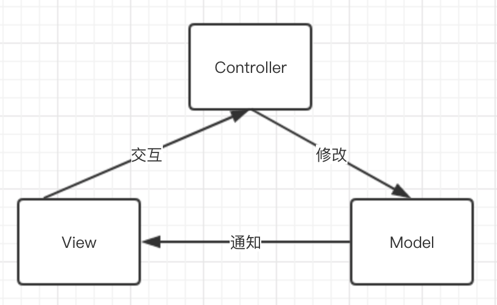
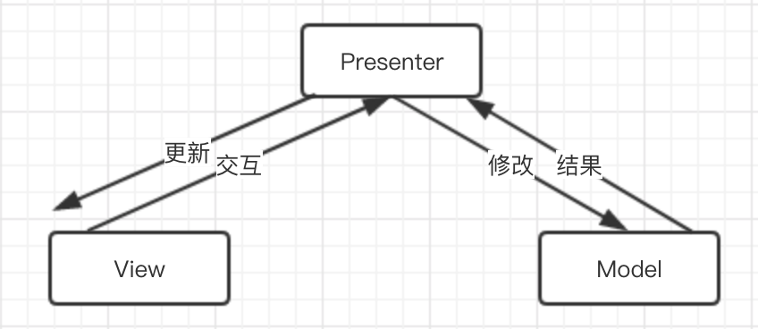

在GUI应用开发中，开发者关注的重点模块主要有3个：
  1. UI的展示
  1. UI和用户的交互逻辑
  1. 业务逻辑

在早期，人们还未针对这种开发场景做优化时，可能习惯于将这三者杂糅在一起。虽然开发起来很快，但是后期维护麻烦，对于大型项目也不利于多人并行开发。
到了70年代，挪威计算机科学家[Trygve Reenskaug](https://en.wikipedia.org/wiki/Trygve_Reenskaug)在SmallTalk-76中引入了一种新的模式，MVC，确切说因该是MVC-Model-1，因为后来为了适应Web开发，该模式又衍生出了MVC-Model-2，也就是我们现在后端常用的各种MVC框架。

> 如果没有明确说明，下面所说的MVC指代的都只是MVC-Model-1

## MVC(Model-View-Controller)

MVC贯彻了SoC(Separation of Concerns)，将UI展示抽为View层，业务逻辑抽为Model层，UI和用户的交互逻辑则抽为了Controller层。
3者的交互流程大致如下：

1. View层订阅了Model的修改事件，同时将用户交互代理到Controller上
1. Controller对交互做一些处理，如果有需要，修改Model数据
1. Model层数据修改之后，通知View层响应更改

**优点**
  1. 关注分离，并且交互逻辑基本都抽到了Controller，对于Model层来说可以提高代码的复用性
  1. 分模块之后各个模块可以并行开发
  1. View的更新只能来自于Model的修改，单向的数据流提高了可回溯性

**缺点**
  1. View层过度依赖Model层，不利于测试和代码复用
  1. Controller逻辑过重，不利于后期维护
  1. Controller层依赖View，不利于测试

## MVP(Model-View-Presenter)

MVP是MVC模式的一个变种，主要提高了代码的**可测试性**。

MVP中View需要定义好一个抽象接口，View和Presenter都需要依赖这个抽象接口来开发，所以Presenter就能通过自行mock一个View对象来提高可测试性。

同时，Presenter作为衔接View和Model的桥梁，负责修改Model以及更新View，这样就可以移除View对Model层的直接依赖，进一步提高了View层的可测试性。

MVP的交互流程如下：

**优点**
  1. 分离View和Model，提高代码可复用性和可测试性
  1. 为View和Presenter定义明确的接口，利于View和Presenter测试

**缺点**
  1. View的更新全由Presenter来维护，会导致presenter过于庞大

## MVVM(Model-View-ViewModel)
最后一个就是老生常谈的MVVM了。最早(不一定准确)应该是由我软在2005年提出的，随着WPF和SilverLight被发扬光大(其实死的很早)。相比较于MVP，Presenter被换成了ViewModel。

从View层考虑，ViewModel其实就是View的一个抽象，包含了他所需的数据和行为。
从Model层来看，ViewModel又像是一个值转换器，将Model转换成View层需要的一种格式，所以有时候MVVM又被称为Model-View-Binder模式。

借助于Data-Binding技术，MVVM完成了Model和View的双向绑定，也不再包含对View层的依赖，让开发者可以更专注于和状态和行为的管理。

在我软技术栈上，Data-Binding主要由XACML来实现，而前端的主流框架，例如React，Vue则是借助于单向数据流+V-DOM diff实现类似效果的。

**优点**
  1. 省去Presenter中Model和View之间的手动同步，移除了对View的依赖
  1. 代码更简洁，可读性更强

**缺点**
  1. 在大型项目上MVVM的性能可能会有问题